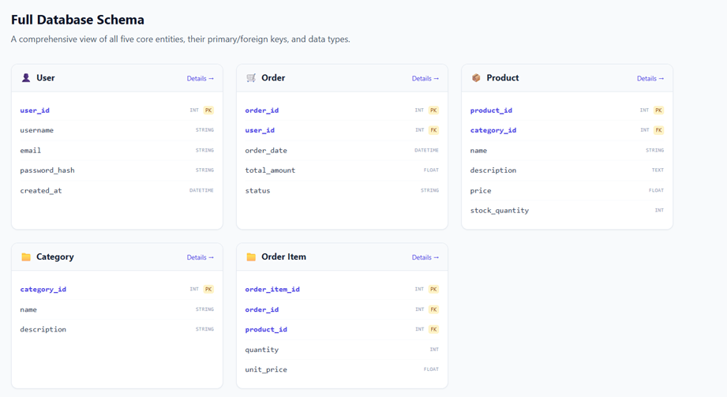

Actividad 7 de Diseño de Apps Web

After completing activity 7, we will populate the database and work with the project documentation:
Create a seeder for users, and register three users:
-Username
-Email
-Password

Next, create a seeder for the robotics kits and register the three kits that the customer provided as test information.
Then, create a factory for the courses, and register 100 courses, remember to consult the FakerPHP documentation so that the fake records have a data type according to what the database will store in production.

ER Diagram
